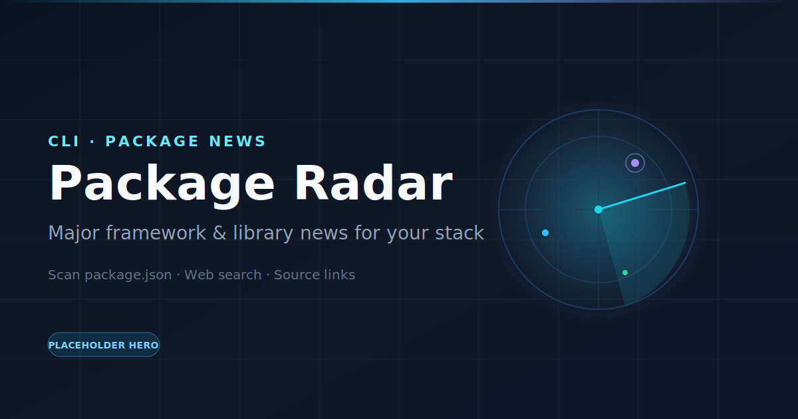

# Code Radar

<p align="center">
  
</p>

<p align="center">
  <strong>A CLI that scans your project and surfaces major package news — with links.</strong>
</p>

---

Code Radar looks at your `package.json` and source tree, detects the stack you actually use (TypeScript, Expo, React Native, Next.js, Drizzle, and more), then pulls **major** framework and library news via OpenAI web search. Each item includes why it matters for *your* repo and links to the original sources.

```
🔍 Scanning your project...

Detected:

✓ React Native 0.82
✓ Expo SDK 54
✓ TypeScript 7
✓ Drizzle ORM

──────────────

🔥 5 things happened this week

1. TypeScript 7

You should care because:
Your project has 1,342 TypeScript files.
This release improves incremental builds.

Sources:
• Announcing TypeScript 7
  https://devblogs.microsoft.com/typescript/...

Recommendation:
Worth testing.

──────────────
```

## Prerequisites

- **Node.js** 20 or later
- **Yarn** (Classic v1 is fine)
- An **OpenAI API key** with access to the Responses API + web search

## Setup

1. Clone the repository and install dependencies:

```bash
yarn install
```

2. Save your OpenAI API key (one-time prompt; stored locally):

```bash
yarn start config
```

The key is written to `~/.code-radar/config.json` with restrictive file permissions. You can also set `OPENAI_API_KEY` in your environment for a one-off run without saving.

### Config & environment

| Variable / path | Required | Description |
| --- | --- | --- |
| `OPENAI_API_KEY` | Yes* | OpenAI API key. Overrides the saved key when set. Get one at [platform.openai.com](https://platform.openai.com/api-keys). |
| `OPENAI_MODEL` | No | Model name (default: `gpt-4.1-mini`). |
| `~/.code-radar/config.json` | — | Local config file where the API key is saved after `yarn start config`. |

\*Required either as env var or saved via `yarn start config`.

```bash
# Inspect whether a key is configured (does not print the secret)
yarn start config --show

# Clear the saved key
yarn start config --clear
```

## Build

Compile TypeScript to `dist/` with tsup:

```bash
yarn build
```

This produces CommonJS + ESM bundles and type declarations under `dist/`. The CLI entry is `dist/index.js` (`bin`: `code-radar`).

## Run

From any Node project directory (or this repo):

```bash
yarn start
```

Or:

```bash
yarn radar
yarn dev
```

After a build you can also run the compiled binary:

```bash
node dist/index.js
# or, if linked:
code-radar
```

### What happens on each run

1. **Scan** — finds the nearest `package.json`, detects known frameworks, counts source files  
2. **Registry check** — looks up latest versions on npm for detected packages  
3. **News search** — asks OpenAI (with web search) for major package/framework announcements  
4. **Report** — prints a short radar with summaries, “why you should care,” recommendations, and source URLs  

Code Radar focuses on **major news** (releases, changelogs, official blog posts). It does **not** run security audits or surface CVE noise.

## Commands

| Command | Description |
| --- | --- |
| `yarn start` | Run the news radar for the current project |
| `yarn start config` | Prompt and save your OpenAI API key |
| `yarn start config --show` | Show whether a key is configured |
| `yarn start config --clear` | Remove the saved API key |
| `yarn start --help` | Print CLI help |
| `yarn typecheck` | Typecheck with `tsc --noEmit` |
| `yarn build` | Build with tsup → `dist/` |

## Project layout

```
code-radar/
  assets/
    hero.svg          # README hero (placeholder — replace anytime)
  src/
    index.ts          # CLI entry
    config.ts         # API key storage (~/.code-radar)
    scan.ts           # package.json + codebase detection
    versions.ts       # npm registry lookups
    analyze.ts        # OpenAI web search + report generation
    format.ts         # Terminal output
  dist/               # Build output
  tsup.config.ts
  tsconfig.json
```

## Tips

- Run Code Radar from the **root of the app you care about** so it picks up that project’s `package.json`.
- Prefer official sources in the report (TypeScript blog, Expo changelog, React blog, GitHub Releases, etc.).
- If web search is unavailable, the CLI falls back to npm version drift plus known official blog/changelog homes for your stack.

## License

ISC
